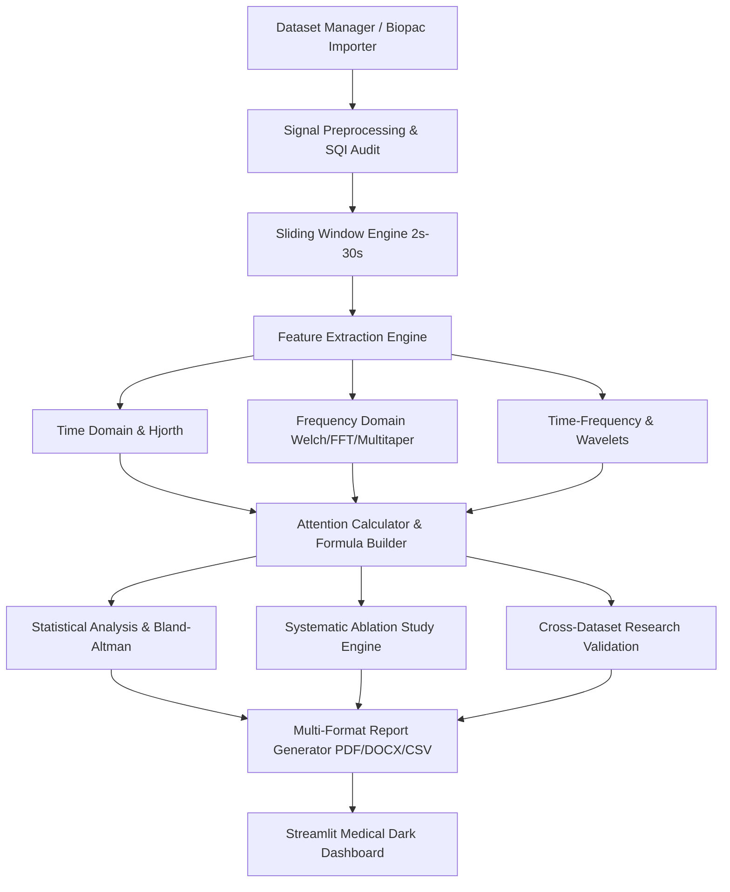

# NeuroLearn Research Suite - System Architecture & Flowchart Documentation

## Executive Overview
The **NeuroLearn Research Suite** is a research-grade Biomedical Signal Processing (BSP) platform designed for EEG-based attention tracking, cognitive state quantification, systematic ablation studies, and cross-dataset research validation (PhysioNet vs. Biopac).

The software operates **strictly without machine learning, deep learning, or black-box predictive models**, relying 100% on mathematical signal processing, spectral analysis, Hjorth parameters, wavelet transforms, and neurophysiological band ratio formulations.

---

## 17 Core Modular Architecture

### Module Responsibilities:
1. **Dataset Manager** (`data/loader.py`): Parses `.edf`, `.mat`, `.csv`, and `.txt` files with automatic metadata detection ($f_s$, channel labels, duration, units).
2. **Biopac Import Manager** (`data/biopac.py`): Normalizes AcqKnowledge MAT/CSV exports into standard `EEGData` objects.
3. **EEG Viewer** (`dashboard/pages/02_EEG_Viewer.py`): Interactive scrollable multi-channel signal viewer.
4. **Signal Quality Assessment (SQI)** (`preprocessing/quality.py`): Computes SQI scores (0-100%), SNR (dB), kurtosis spikes, flat-line detection, and auto-excludes bad channels.
5. **Signal Preprocessing** (`preprocessing/cleaner.py`): Zero-phase Butterworth Bandpass (1–40 Hz), 50 Hz Notch filter, baseline detrending, and standardization.
6. **Windowing Engine** (`segmentation/windowing.py`): Sliding window epoching (2s, 5s, 10s, 20s, 30s) with configurable overlap (0%–90%).
7. **Feature Extraction Engine** (`features/extractor.py`): Extracts Time Domain, Frequency Domain, Hjorth, and Wavelet metrics.
8. **Frequency Analysis** (`features/frequency_domain.py`): Welch, FFT, and Multitaper PSD, SEF95, Spectral Entropy, and Band Powers.
9. **Attention Analysis** (`attention/calculator.py`): Non-ML ratio formulations, safe AST custom formula builder, 0–100 scaling, and 5-level rule-based state classification.
10. **Statistical Analysis** (`stats/analyzer.py`): Parametric/non-parametric hypothesis tests, Shapiro-Wilk normality checks, Cohen's $d$, and Bland-Altman agreement.
11. **Ablation Study Engine** (`ablation/engine.py`): Systematic comparative evaluation across Preprocessing pipelines, Window sizes, PSD methods, and Formulas.
12. **Research Validation Engine** (`validation/engine.py`): Direct cross-dataset comparison (PhysioNet vs. Biopac).
13. **Visualization Engine** (`visualization/plots.py`): High-resolution exportable Plotly charts.
14. **Report Generator** (`reports/generator.py`): IEEE/Frontiers-styled multi-format PDF (ReportLab), Word DOCX, and CSV exporter.
15. **Experiment Tracker** (`experiments/tracker.py`): 100% reproducible state snapshotting and hashing.
16. **Configuration Manager** (`config/manager.py`): YAML configuration manager.
17. **Plugin Manager** (`plugins/manager.py`): Dynamic filter, feature, and formula extension architecture.
